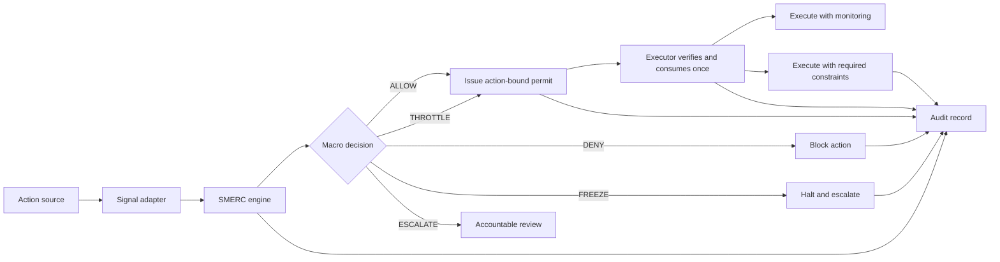

# System Architecture

## Components

1. Action Source: AI agent, workflow engine, fraud system, fleet platform, banking system, insurance workflow, or autonomous controller proposes an action.
2. Signal Adapter: Converts domain context into normalized SMERC signals.
3. SMERC Engine: Computes stress, confidence, reason codes, and macro decision.
4. Permit Layer: For eligible enforcement decisions, binds the exact action, tenant, executor, policy, constraints, and expiry into a signed single-use capability.
5. Enforcement Layer: Verifies and consumes the permit immediately before applying `ALLOW` or `THROTTLE`; `DENY`, `FREEZE`, and `ESCALATE` do not receive permits.
6. Audit Layer: Stores input signals, decision, policy, permit issuance/consumption, reviewer identity, override status, and final outcome.
7. Review Layer: Routes constrained, denied, frozen, or escalated actions to accountable humans.

## Reference Flow

## Integration Notes

SMERC should be deployed at authorization boundaries: before tool calls, production writes, transaction release, claim payment, vehicle route escalation, or other material actions. The executor, not the proposing agent, should consume the permit so an agent cannot treat its own proposal as authorization.
