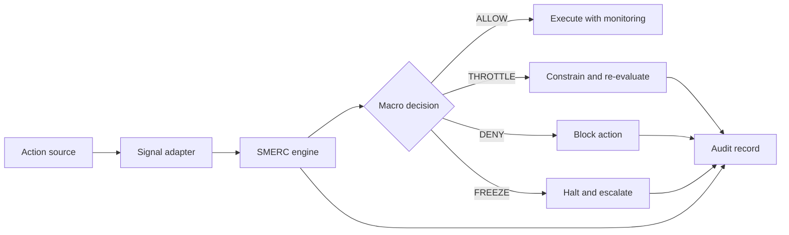

# System Architecture

## Components

1. Action Source: AI agent, workflow engine, fraud system, fleet platform, banking system, insurance workflow, or autonomous controller proposes an action.
2. Signal Adapter: Converts domain context into normalized SMERC signals.
3. SMERC Engine: Computes stress, confidence, reason codes, and macro decision.
4. Enforcement Layer: Applies `ALLOW`, `THROTTLE`, `DENY`, or `FREEZE`.
5. Audit Layer: Stores input signals, decision, reason codes, reviewer identity, override status, and final outcome.
6. Review Layer: Routes constrained, denied, or frozen actions to accountable humans.

## Reference Flow

## Integration Notes

SMERC should be deployed at authorization boundaries: before tool calls, production writes, transaction release, claim payment, vehicle route escalation, or other material actions.
