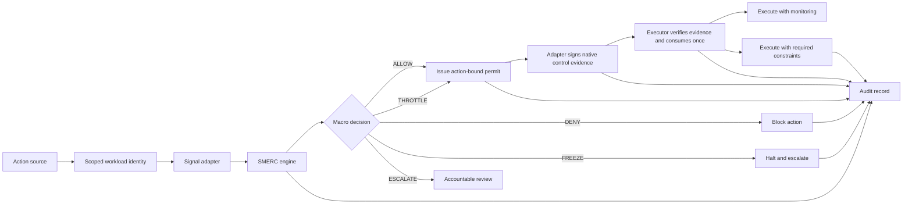

# System Architecture

## Components

1. Action Source: AI agent, workflow engine, fraud system, fleet platform, banking system, insurance workflow, or autonomous controller proposes an action.
2. Workload Identity Gate: Authenticates a tenant principal and checks endpoint scope before any protected operation.
3. Signal Adapter: Converts domain context into normalized SMERC signals.
4. SMERC Engine: Computes stress, confidence, reason codes, and macro decision.
5. Permit Layer: For eligible enforcement decisions, binds the exact action, tenant, executor, policy, constraints, and expiry into a signed single-use capability.
6. Control Evidence Layer: A configured execution adapter signs fresh native control results bound to the exact permit and action.
7. Enforcement Layer: Verifies control evidence and consumes the permit immediately before applying `ALLOW` or `THROTTLE`; `DENY`, `FREEZE`, and `ESCALATE` do not receive permits.
8. Audit Layer: Stores authenticated principal, input signals, decision, policy, permit issuance/consumption, bounded control-evidence attribution, reviewer identity, override status, and final outcome.
9. Review Layer: Routes constrained, denied, frozen, or escalated actions to accountable humans.

## Reference Flow

## Integration Notes

SMERC should be deployed at authorization boundaries: before tool calls, production writes, transaction release, claim payment, vehicle route escalation, or other material actions. Separate scoped identities should propose, issue, and consume so an agent cannot treat its own proposal as authorization. Adapter signing keys must remain inside the component that observes native enforcement results.
